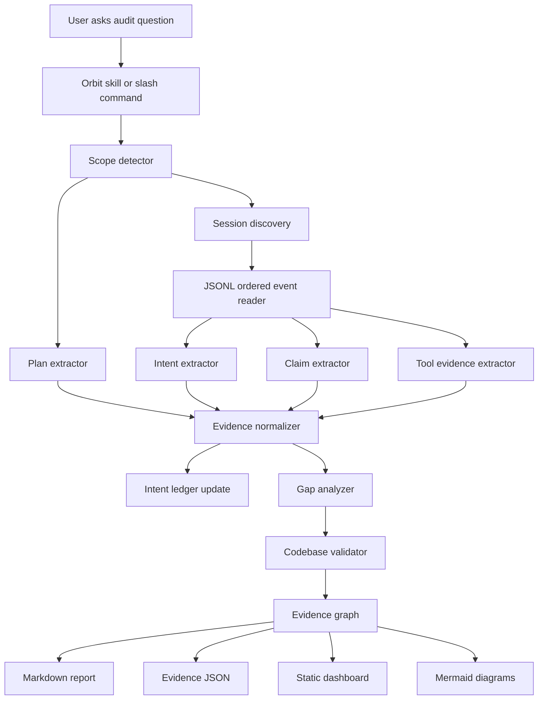

# Orbit v0.2 PRD / PRP

## Summary

Orbit is a Claude Code plugin for mining existing session transcripts, extracting durable user intent, comparing intent against plans and assistant claims, validating claims against codebase truth, and rendering a visual dashboard of gaps and remediation priorities.

## Name

Orbit

## Tagline

Find drift. Close gaps. Restore alignment.

## Brand

Flat black base with hyper-accent colors:

- Lime `#C6FF00`
- Orange `#FF8A00`
- Red `#FF4D36`
- Purple `#8B3DFF`
- Blue `#1E6BFF`

## Goals

1. Mine existing Claude Code JSONL session transcripts.
2. Extract durable user intent, corrections, pivots, renames, validation requests, and visualization requests.
3. Build a compact local intent ledger.
4. Compare intent, plans, assistant claims, tool evidence, and current repo truth.
5. Validate completion claims.
6. Generate gap analysis and remediation recommendations.
7. Render static local dashboard artifacts.
8. Package as a plug-and-play plugin with skills, commands, hooks, references, examples, and flat Python helper scripts.

## Non-Goals

Orbit does not duplicate raw transcript capture, replace Claude Code session storage, run destructive commands, or require Docker.

## Core Flow



## Evidence Ranking

1. Later direct user instruction
2. Specific user correction
3. Direct session evidence tied to implementation
4. Tool-use evidence showing actual action
5. Tool-result evidence showing success or failure
6. Current codebase state
7. Test/build/lint validation result
8. Earlier direct user instruction
9. Written plan evidence
10. Assistant claim or summary
11. Inference across multiple sources
12. History metadata only

## Commands

- `/orbit:audit-gaps`
- `/orbit:mine-intent`
- `/orbit:validate-claims`
- `/orbit:compare-plan`
- `/orbit:render-dashboard`
- `/orbit:review-window`
- `/orbit:review-last-3-days` legacy alias
- `/orbit:rebuild-ledger`

## Time Window Requirement

`review-window` defaults to `--days 3` and supports:

```text
--days N
--since YYYY-MM-DD
--from YYYY-MM-DD --to YYYY-MM-DD
```

## Outputs

```text
.claude/audits/latest/gap-analysis.md
.claude/audits/latest/evidence.json
.claude/audits/latest/dashboard.html
.claude/audits/latest/intent-gap-flow.mmd
.claude/audits/latest/intent-timeline.mmd
.claude/audits/latest/plan-execution-matrix.csv
.claude/audits/intent-ledger.jsonl
.claude/audits/intent-ledger.md
```

## Approval Scope

Orbit v0.2 is approved exactly as written, with no Docker and no full Python package project. The implementation should be a simple plugin with flat helper scripts.
